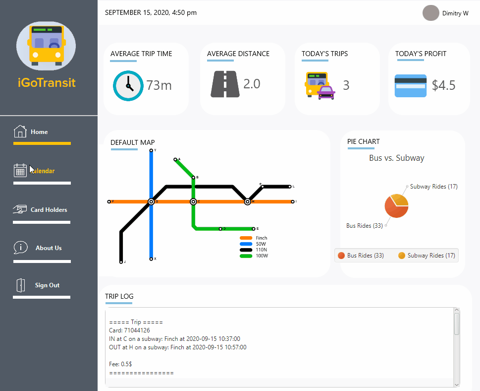
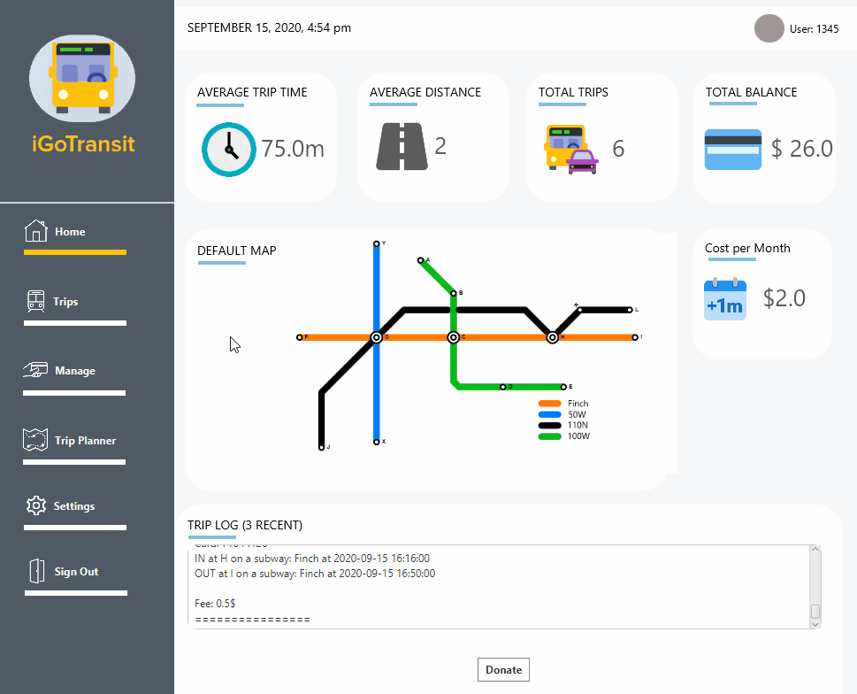

# IGoTransit
A Java program that simulates electronic transit systems in Canada ie. PRESTO, TTC etc. There are two types of users in this program i.e. Admins and Cardholders. Cardholders are civilians utilizing the transportation while the Admin is the owner/manager of said transportation system. 

### Technology and Tools
     

### Admin Demo

### User Demo

### Using the Program
To use this program, clone the repository and run IGoTransit.java in src/igotransit. 

#### Logging in as an Admin
**Username**: admin | **Password**: admin 

#### Logging in as a User
**Username**: Cardholder Account Number | **Password**: CardHolder Account Number 
(you can find them [here](../main/src/testing-files/CardHolders.txt))
   
